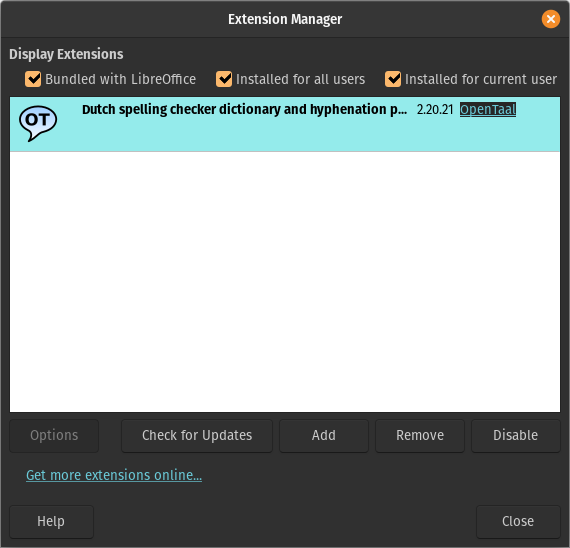

# OpenTaal beta

Latest versions of packages, plug-ins, add-ons and extensions for Dutch word
list and spelling checker dictionary are listed here.

## Word list

Install the latest architecture-independent package from:
- Debian https://packages.debian.org/search?keywords=wdutch
- Ubuntu https://packages.ubuntu.com/search?keywords=wdutch

Manually upgrade by downloading
https://raw.githubusercontent.com/OpenTaal/opentaal-wordlist/master/wordlist.txt
and save that file as `/usr/share/dict/dutch`.

## Spelling checker dictionary for Hunspell

Install the latest architecture-independent package from:
- Debian https://packages.debian.org/search?keywords=hunspell-nl
- Ubuntu https://packages.ubuntu.com/search?keywords=hunspell-nl

Manually upgrade by downloading
https://raw.githubusercontent.com/OpenTaal/opentaal-hunspell/master/nl.dic and
save that file as `/usr/share/hunspell/nl.dic` and by dowloading
https://raw.githubusercontent.com/OpenTaal/opentaal-hunspell/master/nl.aff and
save that file as `/usr/share/hunspell/nl.aff`.

## Hyphenation patterns

Install the latest architecture-independent package from:
- Debian https://packages.debian.org/search?keywords=hyphen-nl
- Ubuntu https://packages.ubuntu.com/search?keywords=hyphen-nl

## Spelling checker dictionary for LibreOffice and OpenOffice.org

Manually upgrade by downloading
from https://extensions.libreoffice.org/en/extensions/show/5711 or directly
https://github.com/OpenTaal/opentaal-beta/raw/main/opentaal-nl_2.20.21_beta.oxt
and installing it via `Tools / Extension Manager... / Add`. Note that this
requires a restart of your office suite.

See also:
- https://bugs.documentfoundation.org/show_bug.cgi?id=139388
- https://cgit.freedesktop.org/libreoffice/dictionaries/tree/Dictionary_nl.mk or
https://cgit.freedesktop.org/libreoffice/dictionaries/plain/Dictionary_nl.mk
- https://cgit.freedesktop.org/libreoffice/dictionaries/tree/nl_NL or
https://cgit.freedesktop.org/libreoffice/dictionaries/plain/nl_NL/

Tasks:
- Update hyphenation patterns in OXT
- Add thesaurus to OXT (current thesaurus file needs to be cleaned up first)
- Update https://extensions.openoffice.org/en/project/dutch-spelling-and-hyphenation-dictionary
